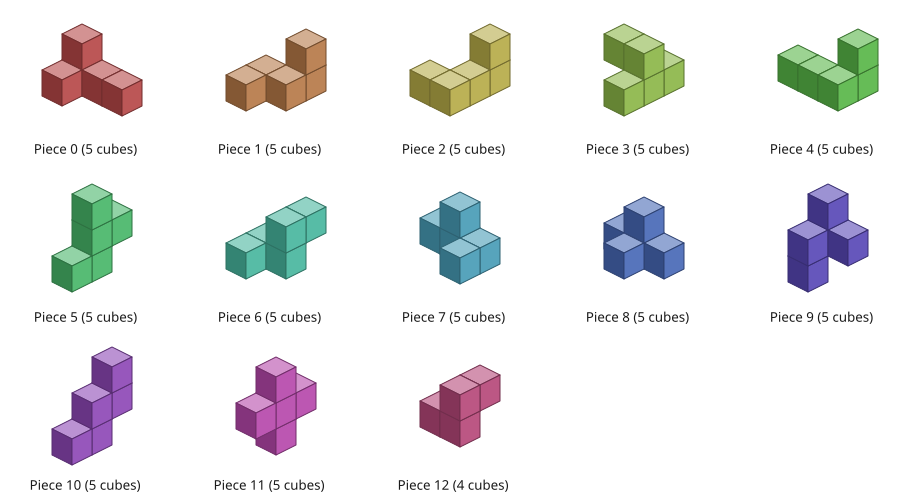
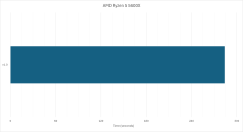
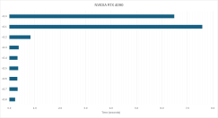

# bedlam
This project is an exhaustive solver for the bedlam cube puzzle.

## The puzzle
The puzzle comprises the following 13 pieces:



The objective is to arrange the pieces to form a 4 x 4 x 4 cube. There are a total of 19,186 unique solutions (not counting the 24 distinct orientations of the complete solution).

## Some personal history
I first tackled this problem around 2000, when I was a physics undergraduate.
I made a lot of sensible choices (symmetry breaking, pre-computed 64-bit bitmasks, and a **recursive backtracking algorithm**) in my original implementation.
It would have eventually found the complete set of solutions, but it achieved a performance of just a few solutions per minute.

## Improvements
It turns out that my biggest mistake was placing each piece, in a pre-defined order, anywhere it would fit.
This frequently places pieces far from each other, where they are largely unconstrained, and results in a very large search tree.

A better approach is an **exact cover** method where, before placing a piece, we identify the lowest numbered empty cell (the target cell).
We then consider all the remaining pieces, but only the placements that would fill the target cell.

For each of the 64 possible target cells, for each of the 13 possible pieces, we can pre-compute a list of valid placements and can even eliminate, up front, placements that would cause a conflict in a lower numbered cell.
For any given target cell, there are up to 24 valid placements per piece (1 per rotation).
I generally pad the lists to a fixed length (25 or 32) to allow previously-placed pieces to be skipped efficiently, with the padding also acting as a null terminator.

Another improvement I have made is to adopt a **non-recursive backtracking algorithm**.
I combine the target cell, piece, and placement into an identifier (ID) and then store the state of the backtracking algorithm as an explicit stack of (up to) 13 IDs.
The ID can also be used to look up a bitmask indicating which cells are occupied by a particular placement of a piece.
```
id = (targetn << 9) + (piecen << 5) + placementn;
```

I sometimes use a compressed ID (CID) to reduce the sizes of lookup tables.
```
cid = targetn * 325 + piecen * 25 + placementn;
```

Since the same bitmask appears in multiple lists it can also be useful to assign each bitmask a unique ID (UID).
Because the pieces all occupy either 2 x 2 x 3 or 1 x 3 x 3 cells, there are up to 18 placements per piece per rotation.
Then, because piece 0 is allowed only 1 rotation (for symmetry breaking), the maximum number of UIDs is 5202 (or 5303 if we also assign a UID to the empty bitmask).

Another useful observation is that bitmasks for different valid placements of a particular rotation of a piece, are all bit-shifted versions of one another.
I refer to the specific version which occupies the first cell (i.e. where bit 0 of the bitmask is set) as the base bitmask.
The base bitmasks can be identified by their rotation ID (RID) which is a combination of the piece and rotation.
```
rid = piecen * 25 + rotn;
```

## GPU computing
I have also created a highly optimised version which uses CUDA 12.1 to target NVIDIA GPUs.
This problem is quite challenging for the GPU because (a) it requires only integer arithmetic, (b) it exhibits thread divergence problems, and (c) it produces a very irregular workload.
I have included a number of snapshots which capture the optimisation process.

There are two kernels.
The first kernel uses brute force to generate a vast number of partial solutions (also referred to as level-4 or level-5 subtrees) in parallel.
The second kernel, where threads use a depth-first search to explore their own subtrees, is launched asynchronously with **no further involvement required from the host CPU**.

## Versions
There are a number of versions included in this repository:
* [v0_1_cpu_historical](v0_1_cpu_historical/) - Original version based on naive recursive backtracking algorithm
* [v1_0_cpu_single_threaded](v1_0_cpu_single_threaded/) - Updated version based on exact cover method and non-recursive backtracking algorithm
* [v2_0_gpu_level4_subtrees](v2_0_gpu_level4_subtrees/) - Initial GPU version based on level-4 subtrees with one thread per subtree
* [v2_1_gpu_persistent_threads](v2_1_gpu_persistent_threads/) - Improved GPU version with persistent threads and a global concurrent queue
* [v2_2_gpu_work_stealing](v2_2_gpu_work_stealing/) - Improved GPU version with a block-local work-stealing mechanism
* [v2_3_gpu_level5_subtrees](v2_3_gpu_level5_subtrees/) - Improved GPU version based on level-5 subtrees
* [v2_4_gpu_cid](v2_4_gpu_cid/) - Improved GPU version with a compressed lookup table for higher L1 cache hit rate
* [v2_5_gpu_cid_uid_l1_shared](v2_5_gpu_cid_uid_l1_shared/) - Improved GPU version with compressed lookup tables in L1 cache and shared memory
* [v2_6_gpu_cid_uid_shared](v2_6_gpu_cid_uid_shared/) - Improved GPU version with compressed lookup tables in shared memory
* [v2_7_gpu_rot_rid_shared](v2_7_gpu_rot_rid_shared/) - Improved GPU version with compressed lookup tables in shared memory and improved occupancy

## Performance
Here is a summary of the performance of the various versions:





The best GPU version running on the NVIDIA RTX 4090 is about **1000X faster** than the single-threaded CPU version running on the AMD Ryzen 5 5600X.
