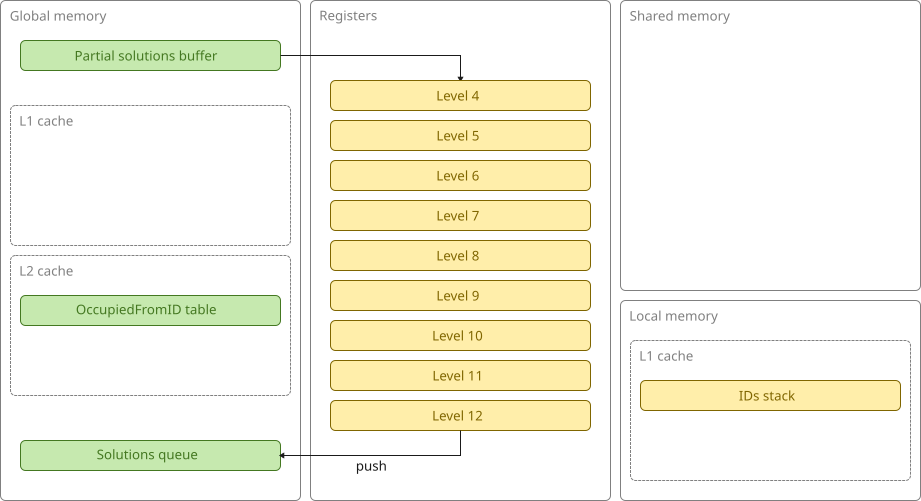
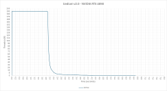

# bedlam v2.0 (GPU, level-4 subtrees)

This version is based on CUDA 12.1.

Each thread reads a level-4 subtree from a partial solutions buffer and then **explores its own subtree entirely in registers**.
There is one small exception: a small stack of IDs which is used by the thread to keep track of its position within the subtree.
Because this is dynamically indexed, it cannot be kept in registers and is instead stored in local memory.

When a thread  discovers a solution, it pushes it to the solutions queue (managed by a global atomic counter).

This is what the architecture looks like:

This is a plot of active threads over time:

This is actually a bit misleading - many apparently active threads are really just waiting for other threads in their block to finish before they can finally be retired.
