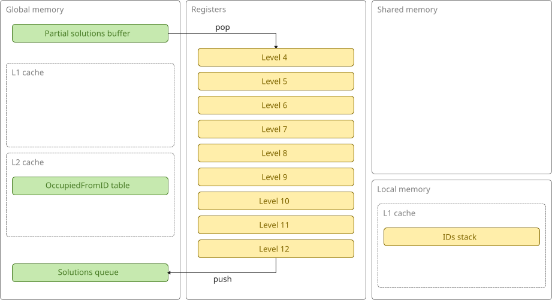
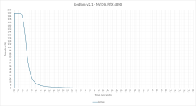

# bedlam v2.1 (GPU, persistent threads)

This version uses persistent threads and a **global concurrent queue** to manage the irregular workload.

Level-4 subtrees are popped from a partial solutions queue (managed by a global atomic counter) to provide **load-balancing across multiple SMs**.
Sufficient threads are created to fully populate the SMs. Each thread runs until it is no longer able to pop a level-4 subtree from the partial solutions queue, at which point it exits.

In all other respects it is the same as v2.0.

This is what the architecture looks like:

This is a plot of active threads over time:

This demonstrates better efficiency in the initial high-throughput phase but then a significantly longer tail.
