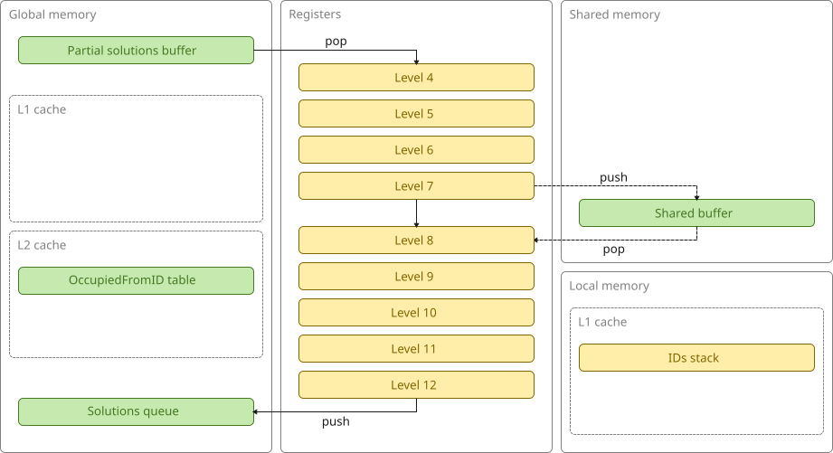
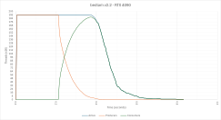

# bedlam v2.2 (GPU, work-stealing)

This version uses a **two-tier load-balancing architecture** to manage the irregular workload.

It uses the same partial solutions queue as v2.1 to provide **load-balancing across multiple SMs** and, for the most part, each thread still **explores its own subtree entirely in registers**.

A block-local work-stealing mechanism is introduced, which reduces the "long tail" effect by **redistributing work across an individual SM**.
When a thread discovers a level-8 subtree, it makes a speculative attempt to push it to a **buffer in shared memory**.
This buffer has just 32 slots (for an entire block of 512 threads) and each thread is connected to a pre-defined slot.
The buffer is protected by atomic operations on a bitmask.
If the thread fails to secure its slot, it continues to process the level-8 subtree itself.
The cost of the failed attempt is a **single atomic operation on shared memory**.

When a thread is no longer able to pop a level-4 subtree from the partial solutions queue, it becomes a consumer of level-8 subtrees from the shared buffer instead.
If it is subsequently unable to pop a level-8 subtree, it simply does nothing for that loop iteration and tries again on the next iteration.
To reduce contention, only one thread per warp is permitted to make the attempt per loop iteration.
The level-8 subtree is popped from the first full slot.
Threads exit when there are no more producers of level-8 subtrees and the shared buffer is empty.

The code is entirely valid (free of race conditions) under Independent Thread Scheduling (Volta and later), but it actually performs slightly better when compiled under the Pascal scheduling model (compute_60) as this eliminates an unwanted YIELD instruction from the SASS output.

This is what the architecture looks like:

This is a plot of active, producer, and consumer threads over time:

The long tail is dramatically reduced but not completely eliminated because an individual SM can still find itself with a collection of large subtrees and no way to offload work to another SM.
