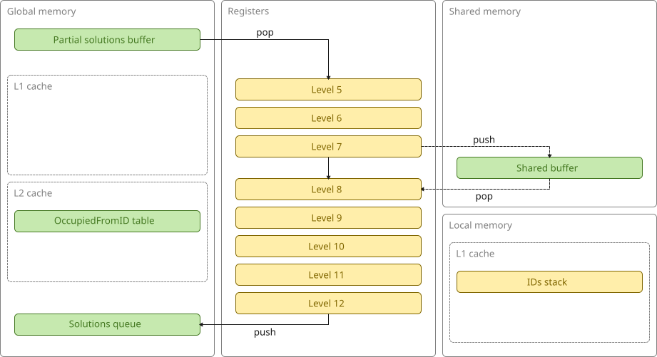
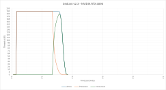

# bedlam v2.3 (GPU, level-5 subtrees, work-stealing)

This version uses the same **two-tier load-balancing architecture** as v2.2 and differs only in that the partial solutions queue now contains level-5 subtrees.
These are smaller and more uniform than the previous level-4 subtrees.

This is what the architecture looks like:

This is a plot of active, producer, and consumer threads over time:

Using smaller subtrees has almost completely eliminated the long tail without resorting to a complicated global work-stealing mechanism.
The time taken to generate the (~28 million) level-5 subtrees is visible at the start of the plot.
