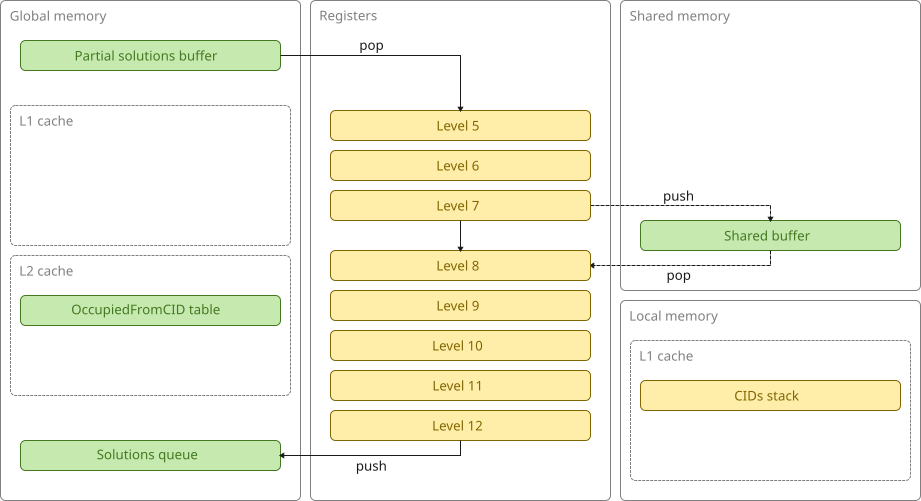
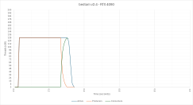

# bedlam v2.4 (GPU, CID)

This version has essentially the same architecture as v2.3 but uses compressed IDs (CIDs) in place of IDs in order to reduce the size of the lookup table and increase the L1 cache hit rate.

This is what the architecture looks like:

This is a plot of active, producer, and consumer threads over time:

