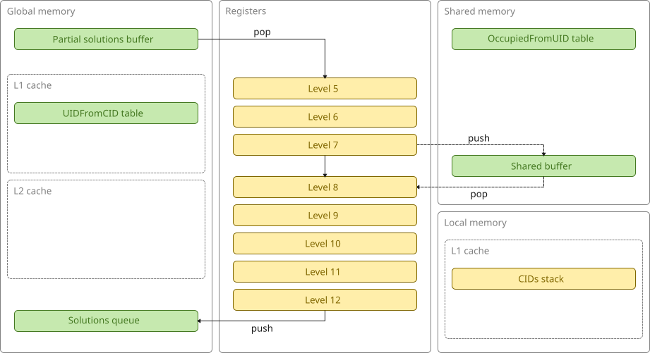
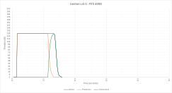

# bedlam v2.5 (GPU, CID/UID, shared)

This version is very similar to v2.4 but with all the lookup tables and the stack of CIDs now in shared memory.

This is what the architecture looks like:

This is a plot of active, producer, and consumer threads over time:

