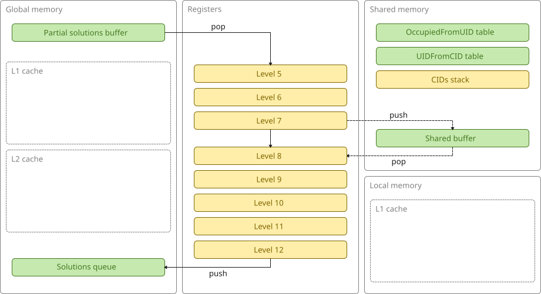
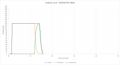

# bedlam v2.6 (GPU, rotation/RID, shared)

This version attempts to recover the lost occupancy by reducing the sizes of the lookup tables even further.

It does so by storing a single base bitmask per piece per rotation (i.e. no tiled versions).
The first lookup uses the ID to retrieve the appropriate rotation.
The piece and rotation are then combined to form the rotation ID (RID) and the second lookup uses the RID to obtain the base bitmask.
The final bitmask is then obtained by bit-shifting the base bitmask.

This is what the architecture looks like:

This is a plot of active, producer, and consumer threads over time:

