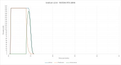

# bedlam v2.8 (GPU, CID)

This version is derived from v2.4, but performs additional tree pruning based on a "no isolated cells" constraint.

This is what the architecture looks like:

This is a plot of active, producer, and consumer threads over time:

